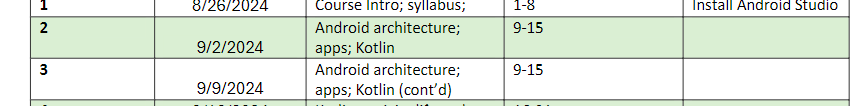

Pick one of the following libraries that are part of the Android Architecture, and write what its purpose is, and some features that it provides.

SQLite

WebKit

OpenGL ES

FreeType

Surface Manager

Media Framework

SSL

SGL

libc

---------------------------------------------

