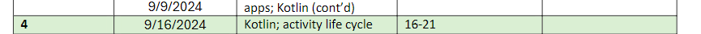

Note:  Weeks 2 and 3 have the same content, so pace yourself

What should you do this week?
For this week, you should do the following:

Preparation
Review the Syllabus carefully
Watch the video lecture I've posted a link to (in Week 2)
Read the book chapters, as indicated in the syllabus
Graded Assessments
Do the Week 3 Engagement under the Discussions

aadasafad

