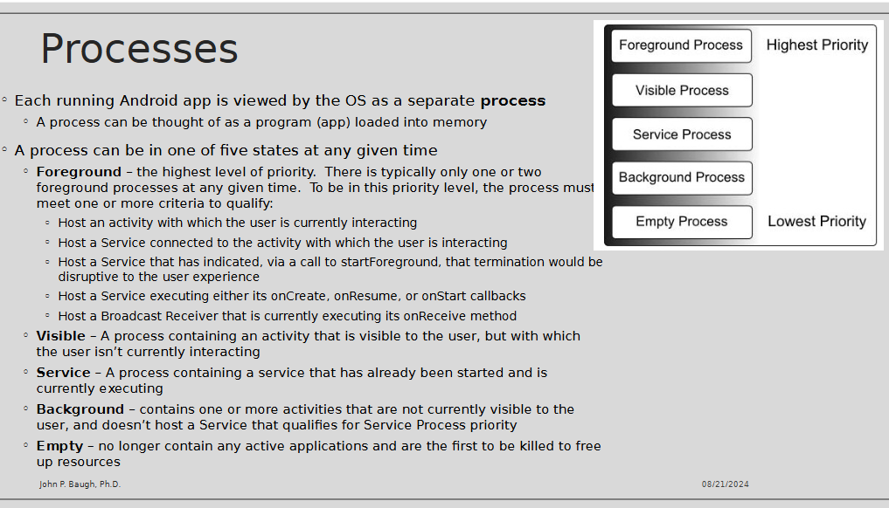

1) Basic Android OS Concepts:

A) What does the Android architectual stack look like?

Chapter 9 -pg 83

B)What Kernal does it use?
pg 84
This is the core of the OS
Provides the foundation of the Android software stack
Provides many functions, such as
Preemptive multitasking
Low-level core system services
Memory, process, power management, etc.
Network stack
Device drivers for hardware

C) What libraries are available?
pg 84

The standard Java development libraries are available
Strings, networking, file manipulation
Android libraries
Java-based libraries
Include application framework libraries
Include libraries such as:
android.app – access to application model
android.content – content access, publishing, messaging between applications and application components
android.database – used to access data with content providers,and SQLite database management classes
android.graphics – low-level 2D graphics drawing API
android.hardware – presents an API for accessing hardware suchas accelerometer and light sensor
android.opengl – Java interface to OpenGL ES 3D graphics API
android.view – fundamental building blocks of GUIs
android.widget = rich collection of pre-built components, layout managers, radio button, buttons, labels, etc.
And many more!

2) What bytecode format are Android applications in?

3) What is an activity?

pg87

4) What is a fragment?
pg 87
Activities are broken up into fragment

5) What is an intent?
  pg 88 

6) What is a broadcast receiver?
pg 88

7) What IDE and companies are most involved with the tools and languages for Android Development?

a) What is IntelliJ IDE? What is Android Studio?

  > IntelliJ IDEA
   This is a popular IDE for both Java and Kotlin development
   Made by JetBrains, who invented Kotlin
   We will use this to learn Kotlin more effectively
   Android Studio will be used for Android Development
   We will use this the most
   Android Studio is built on top of IntelliJ
   

b) What is JetBrains?

  >  JetBrains invented Kotlin

c) What is Oracle?
    
  >  Oracle is database company

8)How do you declare variables and constants in Kotlin?

>Declare variables in Kotlin:

>var x : Int     //mutable int variable

Declare constants in Kotlin:

 >val y = 10 
 >
 > //Declare and initialize an immutable Int variable

9) How do you make nullable variables in Kotlin?

> pg 100
> 
> val username: String? = null
>
> The var keyword allows us to change (or mutate) the value of a variable
var someData = 150//later…somedata = 200   //OK!
The val keyword means the value cannot be changed
val myVal = 100//latermyVal = 20   //ERROR!  myVal is immutable

10) How do you safely access methods or properties of nullable variables (ensuring you don’t get a 
null pointer exception) 
 
 >Nullable types don’t fundamentally exist in most other programming languages
 With the exception of the optional type in Swift
 By default, a variable in Kotlin cannot be assigned null
 val username : String = null     //will NOT compile
 To explicitly allow for a variable to be assigned null, you must declare it as nullable
 val username : String? = null    //this WILL compile because of the ?
 However, what if you do the following?
 val firstName : String = username    //username is nullable, firstName is not, so this is a compiler ERROR
 You can only perform this assignment (or method call!) if you somehow ensure the nullable type is NOT in fact, null
 if(username != null) {   val firstName : String = username    //OK since we know username isn’t null}
 But, there is a better way – the safe call operator, ?.
 val theLength = username?.length 
 

11)  Know about control statements in Kotlin 
  
  
  
a. Selection control (if, if-else, when) 

>

b. Repetition control (while, do-while, for) 
 
 >
 

12)    Basic object-oriented syntax in Kotlin 

 >More on Kotlin
and View
Binding --> .pdf 

a. How do you create an instance of a class? 

>

b. What are primary and secondary constructors? 

>

c. What are custom accessors? 

 
13) Know about the priorities of process states in Android 
 
lec4-lifecycle-activities - .pdf
>

14) Know dynamic vs persistent state 
 

15) Know what views, layouts, and widgets are and how they are related 
 
16) Know what constraints are 
a. What is bias? 
b. What are guidelines? 
c. What are margins? 
d. What are chains? 
e. What are opposing constraints? 
 
17) How do you register event handlers? 
a. In XML or Kotlin? 
 